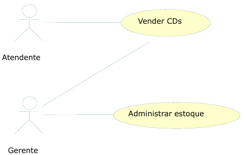
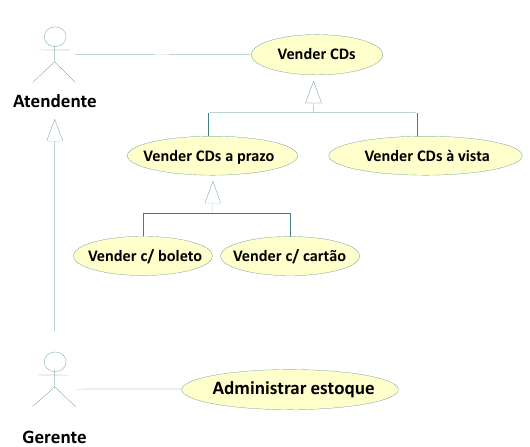

# Projeto Integrador - Modelo
*(baby corporation.)*

Um modelo para o desenvolvimento do Projeto Integrador do Curso de Técnico em Desenvolvimento de Sistemas para a Internet Integrado ao Ensino Médio do IFC - Campus Araquari.
*(Em nosso site pode-se achar serviços de babás e seu curriculo logo abaixo.)*

**IMPORTANTE**: [**Cadastre seu projeto nesta planilha**](https://docs.google.com/spreadsheets/d/1bSb1-S9qOf46fNH8quyoFpcjcTuBMj_EdSPchOuFULY/edit?usp=sharing).

Professor: [Marco André Mendes](github.com/marcoandre)

Equipe:
- [Pedro Gabriel Vieira](https://github.com/pedropg22)
- [Daniel Henrique Fernades ](https://github.com/danielhenrique090109)
- [Lucidrey Valentina Maita Bonilla](https://github.com/Lucidrey).

Links do projeto:
(*https://github.com/babys-corporation*)
-   [Documentação (esse documento)](github.com/marcoandre/pi-modelo)
-   Backend: [Repositório](github.com/marcoandre/pi-backend) e [Publicação](https://pi-backend.herokuapp.com/)
-   Frontend: [Repositório](github.com/marcoandre/pi-frontend) e [Publicação](https://pi-frontend.herokuapp.com/)

**Como usar esse modelo para o Projeto Integrador**

*(Essa parte pode ser apagada depois.)*

1. Faça um fork desse repositório para a sua conta do GitHub.
2. Clone o repositório para o seu computador.
3. Abra o arquivo README.md no seu editor de texto favorito (recomendamos o [Visual Studio Code](https://code.visualstudio.com/)).
4. Tenha instaladas as seguintes extensões:
   - [Markdown All in One](https://marketplace.visualstudio.com/items?itemName=yzhang.markdown-all-in-one)
   - [TODO Highlight](https://marketplace.visualstudio.com/items?itemName=wayou.vscode-todo-highlight)
5. Edite o arquivo README.md com as informações do seu projeto.

**1.1 Modelos de Sistemas**

**Nessa parte a equipe deve escolher um dos modelos de sistemas para desenvolver o projeto. Ao escolher, escreva uma breve descrição do sistema e o motivo da escolha e pode apagar os outros modelos.**

**1.1.3 Ordem de Serviço (O.S.)**

Um sistema de ordem de serviço é um software que permite a uma empresa, como uma oficina, gerenciar os serviços realizados, os clientes atendidos, etc. Ele é utilizado principalmente em oficinas mecânicas, assistência técnica, etc.

**Exemplos de sistemas de ordem de serviço:**
- Manutenção de computadores, assistência técnica de celulares, etc.
- Manutenção de veículos, etc.
- Manutenção de eletrodomésticos, etc.

 
# 2. Situação Problema

A “Babyscorporation” é uma rede de babás que conecta famílias e profissionais, mas atualmente funciona de forma manual, usando principalmente Whatsapp e planilhas. O agendamento é demorado, porque depende de confirmar disponibilidade individualmente com cada babá, podendo gerar conflitos de horário.

As informações das profissionais são desorganizadas, dificultando a escolha da mais adequada. Além disso, não há controle eficiente dos pagamentos, nem um sistema estruturado de avaliações. A comunicação é dispersa e sujeita a erros.

Esses problemas mostram a necessidade de um sistema que organize e automatize os processos da empresa.

# 3. Descrição da proposta

O software proposto terá como foco centralizar e automatizar o gerenciamento da rede de babás. Ele permitirá controlar agendas, cadastrar profissionais, organizar informações, registrar avaliações e acompanhar pagamentos.

Haverá dois tipos de usuários: o administrador, com acesso completo, as babás, que poderão gerenciar sua disponibilidade e atendimentos e os clientes, que poderam requisitar os serviços da empresa.

Com isso, a empresa ganhará mais organização, agilidade e qualidade no serviço prestado.

# 4. Modelagem de Dados

# 4. Regras de negócio
(*Nessa parte a equipe deve descrever as regras de negócio que serão implementadas no sistema. O texto abaixo descreve o que essa etapa deve conter e pode ser apagado depois.*)

As **Regras de negócio** são orientações e restrições que ajudam a regular as operações de uma empresa. **Regras** foram criadas para **colaborar com o funcionamento**, seja da sociedade, de uma escola, de um jogo, etc. Não seria diferente nas organizações. Vamos abordar melhor sobre esse assunto. Entender o que são as regras de negócio, sua importância, como são aplicadas e
automatizadas na gestão por processo.

**4.1 O que são regras de negócio?**

Um negócio funciona por processos que, por sua vez, são formados por atividades relacionadas entre si.

As funções das áreas de compras, estoque, logística, finanças, vendas e marketing, por exemplo, compõem um processo de fornecimento de um produto ao cliente.

Dentro desses processos, existem regras que devem ser seguidas durante a execução das atividades, que ajudam a definir **COMO** as operações devem ser realizadas e gerenciadas, **POR QUEM**, **QUANDO**, **ONDE** e **POR QUÊ**.

Podemos dizer que as regras de negócio são **limites impostos às operações**, de forma que elas sigam corretamente em direção às políticas e aos objetivos da instituição.

**4.2 Regras para a criação de regras de negócio**

De maneira geral, as regras de negócio devem:
- Ser **simples**, isto é,  ter apenas uma função.
- Ser **completas**, com início, meio e fim.
- Ser possíveis de **mensurar** e **rastrear**.
- Estar em consonância com a **legislação**.
- Estar **atualizadas** e sempre **revisadas**.
- Refletir a **política** e os **valores** da organização.
- Ser **inteligíveis** para os colaboradores e envolvidos no processo.

**4.3 Por que ter regras de negócio?**

- **Padronização de processos:** padronizam os processos e auxiliam a fluirem de forma mais eficiente e automatizada.
- **Controle de processos:** auxiliam no controle de processos, pois falhas são identificadas e corrigidas mais rapidamente.
- **Tomada de decisão:** auxiliam na tomada de decisão e no cumprimento de estratégias pré-estabelecidas.

**4.4 Exemplos de regras de negócio**

- Em um controle de qualidade de granja, pode-se dizer que a cada 100 ovos impróprios para consumo, o lote será descartado.
- Em um banco, clientes com faturamento mensal de mais de R$ 25 mil e CPF sem restrições, serão atendidos pelo gerente Premium pessoa física.
- Para conclusão de licitações, devem ser feitos três orçamentos e o vencedor será sempre o de menor preço final.
- Em um processo de seleção de RH, o candidato só pode ser aprovado se tiver mais de 5 anos de experiência na área, diploma de pós-graduação, espanhol fluente e pretensão salarial abaixo de R$ 8.000,00.
- Em um processo de vendas, o vendedor só pode vender um produto se o cliente tiver mais de 18 anos, renda familiar acima de R$ 5.000,00 e não tiver restrições no CPF.
- Em um processo de compras, o fornecedor só pode ser contratado se tiver nota fiscal, certificado de qualidade e preço abaixo de R$ 10,00 por unidade.
- Em um processo de logística, o pedido só pode ser enviado se o cliente tiver mais de 18 anos, endereço de entrega no mesmo estado e não tiver restrições no CPF.

**4.5 Como escrever regras de negócio?**

- Número identificador.
- Nome da regra.
- Data de criação e data da última alteração para comparações e
controle.
- Nome dos Autores das versões.
- Número da versão (1, 2 etc).
- Dependências: insira o identificador das regras atreladas, às quais a regra em questão depende.
- Uma descrição detalhada para compreensão da regra.

**4.6 Exemplos de regras de negócio com formatação**

- **RN01 – Criação Comanda:** Para iniciar um atendimento no balcão, é necessário primeiro abrir uma nova comanda.
- **RN02 – Inserir Produtos Comanda:** Para inserir um produto na comanda, é necessário que o produto esteja cadastrado no sistema e que a quantia comprada seja acima de zero.
- **RN03 – Cadastro de Leitores:** Os leitores precisam fazer o cadastro para realizar o empréstimo.
- **RN04 – Realizar Empréstimo:** Para realizar o empréstimo, apenas leitores com cadastro e nenhuma multa em aberto.
- **RN05 – Registro de Empréstimo:** O gerente deve possuir acesso aos registros de empréstimos.
- **RN06 – Pagamento de Multa:** O leitor que passar de 15 dias com o livro deverá pagar a multa de um real por dia de atraso.
- **RN07 – Impressão de Orçamento:** Com as informações do
orçamento registradas, a atendente deve imprimir o orçamento e
repassar ao cliente para aprovação, e caso o cliente aprovar, a atendente deve solicitar a sua assinatura para aprovar a execução do serviço.
- **RN08 – Abertura de OS:** Com o atendimento aprovado pelo cliente, a atendente deverá inserir os dados do cliente e do orçamento em um novo documento, para registros internos, realizando a abertura da OS.
- **RN09 – Relatório de Fluxo de Caixa:** O relatório de fluxo de caixa será permitido somente para o administrador.

# 5. Requisitos funcionais
(*Nessa parte a equipe deve descrever os requisitos funcionais que serão implementados no sistema. O texto abaixo descreve o que essa etapa deve conter e pode ser apagado depois.*)

RF001: ao entar no site  o usuario deve ver uma parte introdutoria onde em seu final tera a opção de logar como responsavel ou baba

RF002: se o usuario escolher baba ele deve logar com essas informações: Nome da babá ,Data de nascimento,Experiência,Preço,Educação,Dias disponiveis,Habilidades,Sobre você,CPF,Número de telefone, Endereço ,Alergias, Condições medicas

RF003: se o usuario logar como pais  ele deve cadastrar pais com essas informações: Nome de responsavel,CPF,Número de telefone,Endereço

RF004: o usuario que estiver logando como pai deve tambem cadastar seus filhos com as seguintes informações para cada filho: Nome da criança,Genero,Idade,Alergias,Condições fisicas/mentais

RF005: se o usuario  tiver logado como baba ela deve iniar numa tela onde vera seus medidos os rrspondera.

RF006: o usuario  tipo baba deve ter uma segunda area onde pode ver seu perfil e la adicionar sua foto

RF007: se o usuario logar como pai ele deve iniciar em uma parte onde ele ve as opçoes de babas la tendo um resumo de suas informações e suas fotos

RF008:o site deve ter uma filtragem de nomes localizações e abilidades das babas

RF009: se o usuario tipo pai clicar em um perfil de uma baba , deve-se caregar uma pagina da baba e suas informações onde abaixo avera um calendario com seus dias disponiveis e um botão de atendimento

RF010: o  site deve abrir uma pagina de agendamentos ao clicar em agendamentos na pagina baba do usuario

RF011: a pagina de agendamentos onde dele a informação do preso sua disponibilidade e abaixo um botão de pgamento que levara a sua chave pix

# 6. Requisitos não funcionais

RNF001: o site deve ser feito em cores pasteis

RNF002: o frontend deve ser feito em vue.js

RN003: o backend deve ser feito com pytoon jungle

`` # 7. Diagrama de Caso de Uso

**7.1 Introdução**

O diagrama de caso de uso é uma ferramenta de modelagem que descreve o comportamento de um sistema a partir da perspectiva do usuário. Ele é usado para capturar os requisitos funcionais de um sistema.

- Especificam a visão externa do sistema.
- Descrevem como o sistema é percebido por seus usuários.
- Descrevem as interações entre os usuários e o sistema.

**Os casos de uso:**
- Descrevem como os **usuários interagem com o sistema** (as funcionalidades do sistema)
- Facilitam a **organização dos requisitos** de um sistema.
- Dão uma **visão externa** do sistema
- O conjunto de casos de uso deve ser capaz de comunicar a **funcionalidade** e o **comportamento** do sistema para o cliente.
- Descrevem **o que** o sistema faz, mas **não** especificam **como** isso deve ser feito.

**7.2 Elementos do diagrama de caso de uso**

7.2.1 **Atores**

- Representam os papéis desempenhados por **elementos externos** ao sistema
  - Ex: humano (usuário), dispositivo de hardware ou outro sistema (cliente)
- Elementos que **interagem** com o sistema

Notação:

**Exemplo: Loja de CDs**

**Identificando os atores**
- Uma loja de CDs possui discos para venda. Um cliente pode comprar uma quantidade ilimitada de discos para isto ele deve se dirigir à loja.
- A loja possui um **atendente** cuja função é atender os clientes durante a venda dos discos. A loja também possui um **gerente** cuja função é administrar o estoque para que não faltem discos. Além disso é ele quem dá folga ao atendente, ou seja, ele também atende os clientes durante a venda dos discos.

**E o cliente?**
- Não é ator pois ele **não interage** com o sistema!

**7.2.2 Casos de uso**

- Representam **funcionalidades** do sistema (requisitos funcionais).
- São iniciados por **atores** ou por outros casos de uso.

> **Dica**: nomeie os casos de uso com **verbos** no **infinitivo**.

Notação:

**Exemplo: Loja de CDs**

**Identificando os casos de uso**

- Uma loja de CDs possui discos para venda. Um cliente pode comprar uma quantidade ilimitada de discos para isto ele deve se dirigir à loja. A loja possui um atendente cuja função é atender os clientes durante a **venda dos discos**.
- A loja também possui um gerente cuja função é **administrar o estoque** para que não faltem discos. Além disso é ele quem dá folga ao atendente, ou seja, ele também atende os clientes durante a **venda dos discos**.

**7.2.3 Relacionamentos**

**7.2.3.1 Relacionamento de associação**

- Indica que um ator **participa** de um caso de uso, ou seja, o ator **interage** (comunica-se) com o caso de uso.
- É representado por uma **linha sólida**.
- Um ator pode se relacionar com **um ou mais casos de uso**.

> Dicas:
> - Não use setas nas linhas de associação.
> - Associações não representam fluxo de informação.

**Exemplo: Loja de CDs**

**Identificando os relacionamentos de associação**

- Uma loja de CDs possui discos para venda. Um cliente pode comprar uma quantidade ilimitada de discos para isto ele deve se dirigir à loja. A loja possui um _atendente_ cuja função é atender os clientes durante a **venda dos discos**.
- A loja também possui um _gerente_ cuja função é **administrar o estoque** para que não faltem discos. Além disso é ele quem dá folga ao _atendente_, ou seja, ele também atende os clientes durante a **venda dos discos**.

**7.2.3.2 Relacionamento de generalização/especialização**

**Generalização de atores**

- Quando dois ou mais atores podem se **comunicar com o mesmo conjunto de casos de uso**.
- Indica que um ator **herda** as características de outro ator.
– Um filho (herdeiro) pode se comunicar com todos os casos de uso que seu pai se comunica.

> **Dica:** coloque os herdeiros **embaixo**.

**Notação:**

**Exemplo: Loja de CDs**

**Identificando os relacionamentos de generalização/especialização de atores**

**Generalização de casos de uso**

– O caso de uso filho herda o comportamento e o significado do caso de uso pai.
– O caso de uso filho pode incluir ou sobrescrever o comportamento do caso de uso pai.
– O caso de uso filho pode substituir o caso de uso pai em qualquer lugar que ele apareça.

> **Dica:** deve ser aplicada quando uma condição resulta na definição de
diversos fluxos alternativos.

Notação:

**Exemplo: Loja de CDs**

**Identificando os relacionamentos de generalização/especialização de casos de uso**

**Novos requisitos:**

- As vendas podem ser **à vista** ou **a prazo**. Em ambos os casos o estoque é
atualizado e uma nota fiscal, entregue ao consumidor.
- No caso de uma **venda à vista**, clientes cadastrados na loja e que compram mais de 5 CDs de uma só vez ganham um desconto de 1% para cada ano de cadastro.
- No caso de uma **venda a prazo**, ela pode ser parcelada em 2 pagamentos com um
acréscimo de 20%. As vendas a prazo podem ser pagas no **cartão** ou no **boleto**.
  - Para pagamento com **boleto**, são gerados boletos bancários que são entregues ao cliente e armazenados no sistema para lançamento posterior no caixa.
  - Para pagamento com **cartão**, os clientes com mais de 10 anos de cadastro na loja ganham o mesmo desconto das compras à vista.

**Identificando mais relacionamentos de generalização/especialização de casos de uso**

**7.2.3.3 Relacionamento de dependência**

**Extensão**

- Representa uma variação/extensão do comportamento do caso de uso base.
- O caso de uso estendido só é executado sob certas circunstâncias.
- Separa partes obrigatórias de partes opcionais.
  - Partes obrigatórias: caso de uso base.
  - Partes opcionais: caso de uso estendido.
- Fatorar comportamentos variantes do sistema (podendo reusar este comportamento
em outros casos de uso).

**Notação:**

 - notação")

**Exemplo: Loja de CDs**

**Identificando os relacionamentos de dependência (extensão)**

**Novos requisitos:**
- No caso de uma venda à vista, clientes cadastrados na loja e que compram mais
de 5 CDs de uma só vez ganham um **desconto** de 1% para cada ano de cadastro.
- No caso de uma venda a prazo...
  - ...Para pagamento com cartão, os clientes com mais de 10 anos de cadastro na loja ganham o mesmo **desconto** das compras à vista.

")

**Inclusão**

- Evita repetição ao fatorar uma atividade
comum a dois ou mais casos de uso.
- Um caso de uso pode incluir vários casos de uso.

**Notação:**

 - notação")

**Exemplo: Loja de CDs**

**Novos requisitos:**
Para efetuar vendas ou administrar estoque, atendentes e gerentes terão que **validar** suas respectivas senhas de
acesso ao sistema.

")

**7.2.4 Fronteira do sistema**

- Elemento opcional (mas essencial para um bom
entendimento).
- Serve para definir a área de atuação do sistema, ou seja, seus limites.

**Identificando a fronteira do sistema**

---

